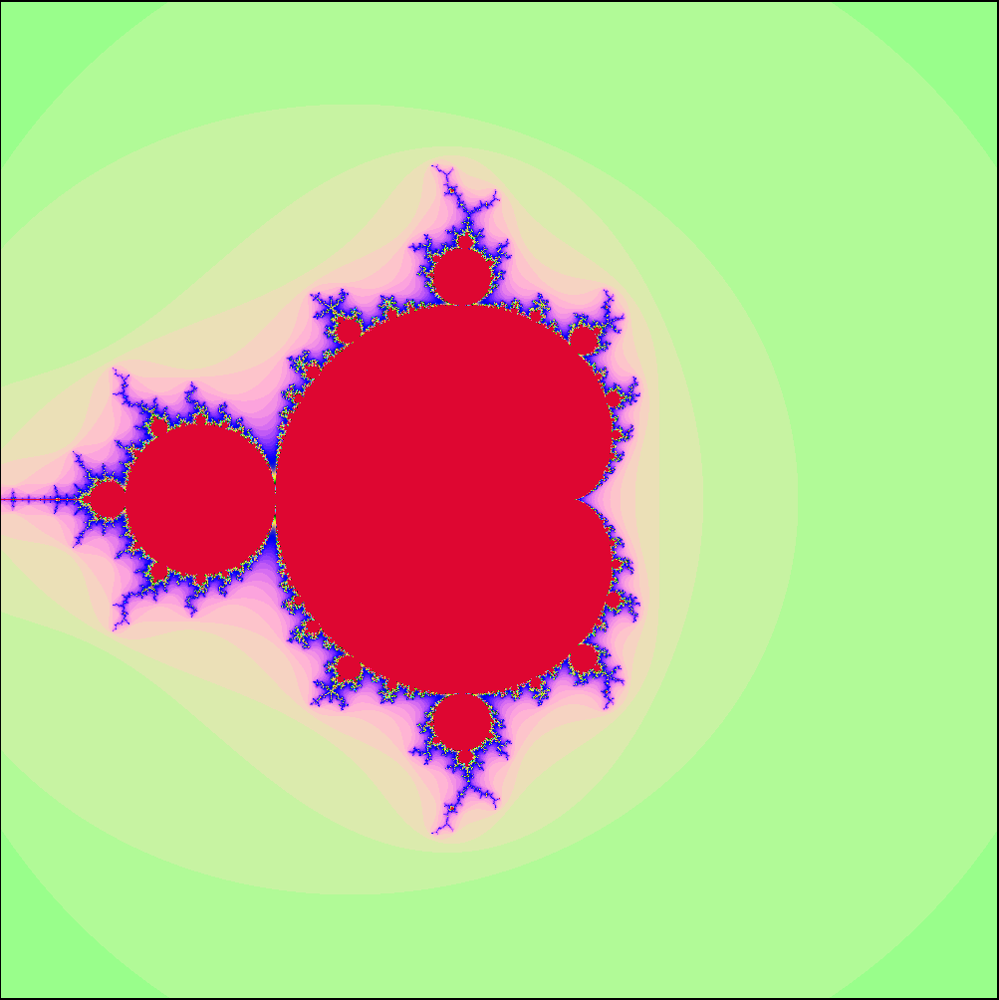
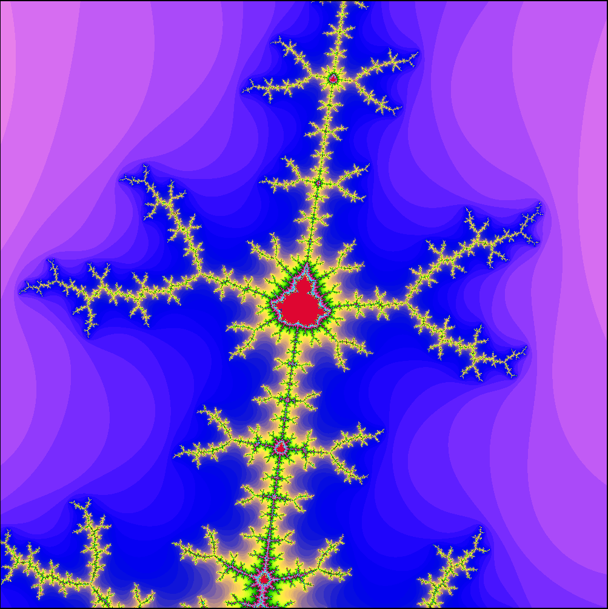

# Haskell Parallel Mandelbrot Viewer

A high-performance, interactive visualization of the Mandelbrot set written in Haskell. This project utilizes the **Gloss** library for 2D graphics and **Control.Parallel** strategies to distribute pixel calculations across multiple CPU cores.

## Screenshots

### Initial View
The standard view of the Mandelbrot set at startup.


### Zoomed View (~5x)
Detail view showing the fractal structure after zooming in approximately 5 times.


## Description

This application renders the Mandelbrot set, a famous fractal defined by the set of complex numbers $c$ for which the function $f_c(z) = z^2 + c$ does not diverge when iterated.

Unlike standard sequential renderers, this program leverages Haskell's lightweight threads to calculate pixel data in parallel, utilizing the full capacity of your CPU during rendering.

## Features

* **Interactive Zooming:** Left-click anywhere on the set to re-center and zoom in (2x magnification).
* **Parallel Rendering:** Uses `parMap` with the `rpar` strategy to evaluate pixels concurrently.
* **Rainbow Coloring:** Algorithmic coloring based on iteration count to visualize divergence speed.
* **Real-time Rendering:** Renders a 1000x1000 pixel grid.

## How It Works

1.  **Coordinate Mapping:** The window pixels (x, y) are mapped to the complex plane.
2.  **The Algorithm:** For every pixel, the program runs the iterative equation $z_{n+1} = z_n^2 + c$ up to 200 times.
3.  **Parallel Strategy:**
    * The list of all pixels is generated.
    * The function `parMap rpar` is applied to this list. This hints to the Haskell Runtime System (RTS) that these calculations can be sparked as parallel tasks.

## Recommended Requirements

* **OS:** Linux (Ubuntu tested & recommended), macOS, or Windows (via WSL2).
* **CPU:** Multi-core processor (Quad-core or higher recommended for best parallel performance).
* **RAM:** 4GB+ (The Gloss library creates a `Picture` object for every pixel, which can be memory-intensive at high resolutions).

## Installation & Setup

### 1. Install Haskell Toolchain (GHCup)
If you do not have Haskell installed, use the standard GHCup installer. Run the following in your terminal:

```bash
curl --proto '=https' --tlsv1.2 -sSf [https://get-ghcup.haskell.org](https://get-ghcup.haskell.org) | sh
```

* Follow the on-screen prompts.
* **Restart your terminal** after installation to refresh your `PATH`.

### 2. Install System Dependencies (Ubuntu/Debian)

The `gloss` library requires OpenGL and GLUT development packages.

```bash
sudo apt-get update
sudo apt-get install freeglut3-dev
```

## How to Run

You can run the project in **Interpreted Mode** (easier for development) or **Compiled Mode** (required for actual multi-core performance).

### Option A: Quick Run (Interpreted)

Use `stack` to run the script immediately. This is slower but useful for testing.

```bash
stack runghc --package gloss --package parallel index.hs
```

or

```bash
stack runhaskell ./index.hs
```

### Option B: High Performance (Compiled)

To utilize all CPU cores, you must compile with the threaded runtime.

### 1. Compile the program:

```bash
stack ghc -- -O2 -threaded -rtsopts -with-rtsopts=-N index.hs -o mandelbrot
```

* `02`: High optimization.
* `-threaded`: Enable multi-threaded runtime.
* `-with-rtsopts=-N`: Use all available CPU cores.

### 2. Run the executable:

```bash
./mandelbrot
```

## Controls

* **Left Click:** Recenter the view on the mouse cursor and Zoom In (2x).
* **Esc** Quit the application.